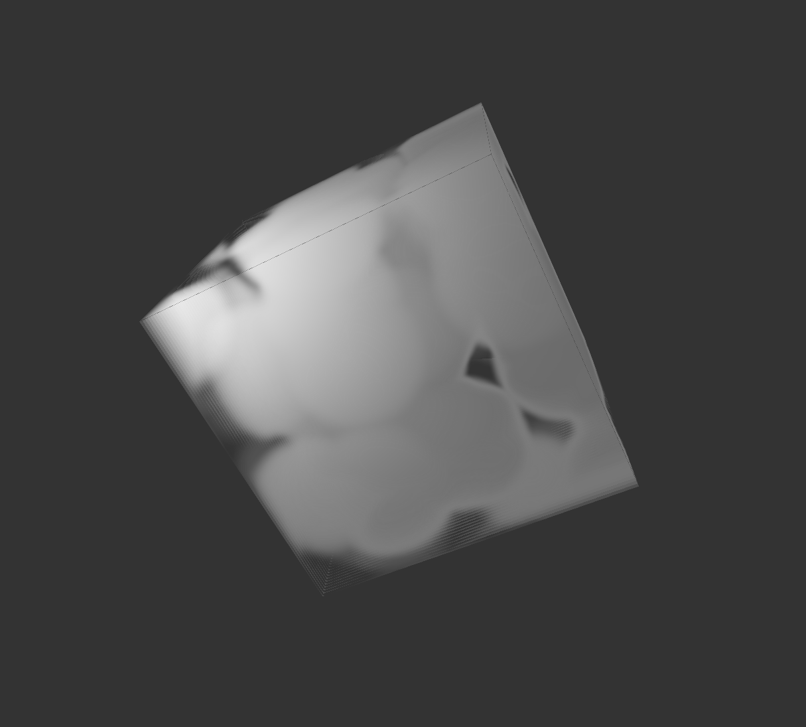

# HW 0: Intro to Javascript and WebGL

  

  

## Submission Details

The cube uses ray marching over a 3D texture of Worley noise to simulate clouds.
- The texture is generated at runtime, stored in the memory, and only regenerates upon parameter changes.
- The texture is mapped to the entire and exact volume of the cube
The GUI supports changes to
- texSize - The resolution of the 3D Worley texture
- cellSize - The number of cells/the scaling of the Worley texture
- distortion - The strength of the non uniform transformation of the cube over time
- absorptionStrength - The light absorption strength at each step inside the volume. Higher value means the cloud absorbs more light
- forwardScatteringDensing - The condensing strength of forward scattering angle. Higher value means forward scattering is only visible within a smaller range of view angle
- step - The number of steps of ray marching
- objColor - The custom color of the object

  

## Live Demo

[https://cystronofer.github.io/5660-hw-0/](https://cystronofer.github.io/5660-hw-0/)